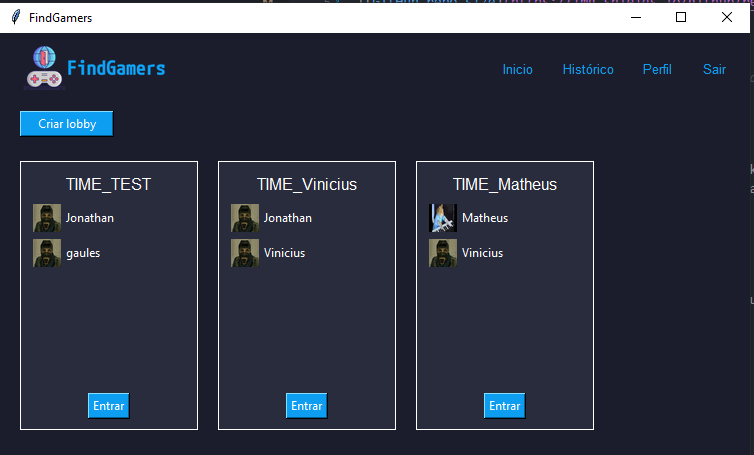

# FindGamers

<!---Esses são exemplos. Veja https://shields.io para outras pessoas ou para personalizar este conjunto de escudos. Você pode querer incluir dependências, status do projeto e informações de licença aqui--->




> Um sistema para jogadores que desejam jogar partidas em equipe de forma organizada e competitiva.

### Descrição

Um projeto que utiliza a conexão TCP e a api de Sockets do python para criar um sistema com arquitetura cliente-servidor. O sistema permite que os jogadores criem grupos ou se juntem a grupos existentes e, quando o grupo estiver completo com cinco membros, possam selecionar outros grupos para jogar uma partida.


## 💻 Pré-requisitos

Antes de começar, verifique se você atendeu aos seguintes requisitos:

* Python 3

## 🚀 Instalando Dependências

Para instalar as dependências e deixar o computador pronto para executar o programa, siga estas etapas:

Linux e macOS:
```
python -m venv venv
chmod +x venv/bin/activate
./venv/bin/activate
pip install -r requirements.txt
```

Windows:
```
python -m venv venv
./venv/Scripts/Activate
pip install -r requirements.txt
```

## ☕ Usando FindGamers

Para usar o projeto, siga estas etapas abaixo: 

Em um terminal abra no caminho do arquivo [Makefile](./Makefile) e digite o comando a seguir para iniciar o servidor:
```
make run_server
```

Em um outro terminal, também no caminho do arquivo [Makefile](./Makefile), digite o comando a seguir para executar o client. É importante que o servidor já esteja rodando para o client funcionar corretamente.
```
make run_client
```

O exemplo acima considera que você esteja em uma máquina linux, para mais instruções veja no arquivo [INSTRUÇÃO](./docs/INSTRUCAO.md).

## 🤝 Colaboradores


<table>
  <tr>
    <td align="center">
      <a href="#">
        <br>
        <sub>
          <b>Vinicius Teixeira</b>
        </sub>
      </a>
    </td>
    <td align="center">
      <a href="#">
        <br>
        <sub>
          <b>Jonathan Lopes</b>
        </sub>
      </a>
    </td>
    <td align="center">
      <a href="#">
        <br>
        <sub>
          <b>Matheus da Silva Alves</b>
        </sub>
      </a>
    </td>
  </tr>
</table>

[⬆ Voltar ao topo](#FindGamers)<br> 