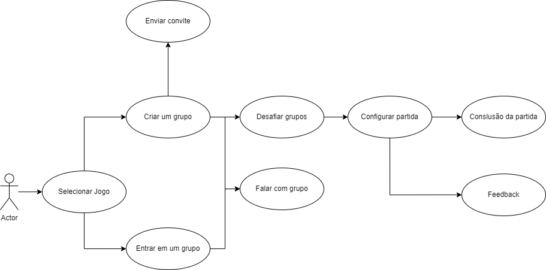

# Rede Social - FindGamers

> **Grupo**: Vinicius Teixeira, Matheus Silva, Jhonatan Lopes

Neste repositório apresentamos um sistema para jogadores que desejam jogar partidas em equipe de forma organizada e competitiva chamado FindGamers.
O sistema permite que os jogadores criem grupos ou se juntem a grupos existentes e, quando o grupo estiver completo com cinco membros, possam selecionar outros grupos para jogar uma partida. O sistema tamb´em oferece maneiras para que os jogadores possam se comunicar e planejar suas
estrat´egias antes da partida.

O objetivo do sistema ´e fornecer aos jogadores uma maneira f´acil e eficiente de encontrar jogos competitivos, al´em de promover uma experiˆencia de jogo mais organizada e colaborativa. Com o sistema, os jogadores podem se concentrar na estrat´egia e no desempenho da equipe, em vez de gastar tempo procurando por outros jogadores para formar uma equipe.

Este artigo descreve os requisitos funcionais mais importantes para o sistema e apresenta um diagrama UML dos casos de uso do sistema. Ele pode ser usado como uma referˆencia para o desenvolvimento do sistema e para garantir que todos os requisitos funcionais sejam abordados de forma adequad

## Requisitos funcionais 

Para atingir o objetivo do sistema listamos os principais requisitos funcionais para que o sistema funcione de maneira objetiva e eficiente. S˜ao
eles:

1. Cadastro de jogadores: permitir que os jogadores se cadastrem no sistema, fornecendo informa¸c˜oes como nome de usu´ario, senha, e-mail e
outras informa¸c˜oes relevantes.
2. Cria¸c˜ao de grupos: permitir que os jogadores criem seus pr´oprios grupos, o nome do grupo ´e difinido como ’time nome do criador’, ex.: time
Matheus.
3. Entrar em grupos: permitir que os jogadores encontrem e entrem em
grupos existentes.
4. Convite de jogadores: permitir que os membros do grupo convidem
outros jogadores para se juntarem ao grupo.
5. Formação de partidas: quando o grupo estiver completo, pode desafiar
outros grupos para criarem uma partida
6. Seleção de jogo: permitir que o grupo escolha o jogo.
7. Seleção de modo de jogo: permitir que o grupo escolha o modo de jogo
e o mapa da partida.
8. Chat do grupo: permitir que os membros do grupo se comuniquem
entre si, planejando estrat´egias e discutindo t´aticas.
9. Conclus˜ao da partida: permitir que a partida seja conclu´ıda e que os
resultados sejam mostrados na plataforma, permitindo a an´alise das
estat´ısticas de desempenho dos jogadores.
10. Feedback: permitir que os jogadores forne¸cam feedback sobre jogadores
e a partida

## Casos de uso

Abaixo segue um modelo UML dos casos de uso para o sistema FindGamers.

